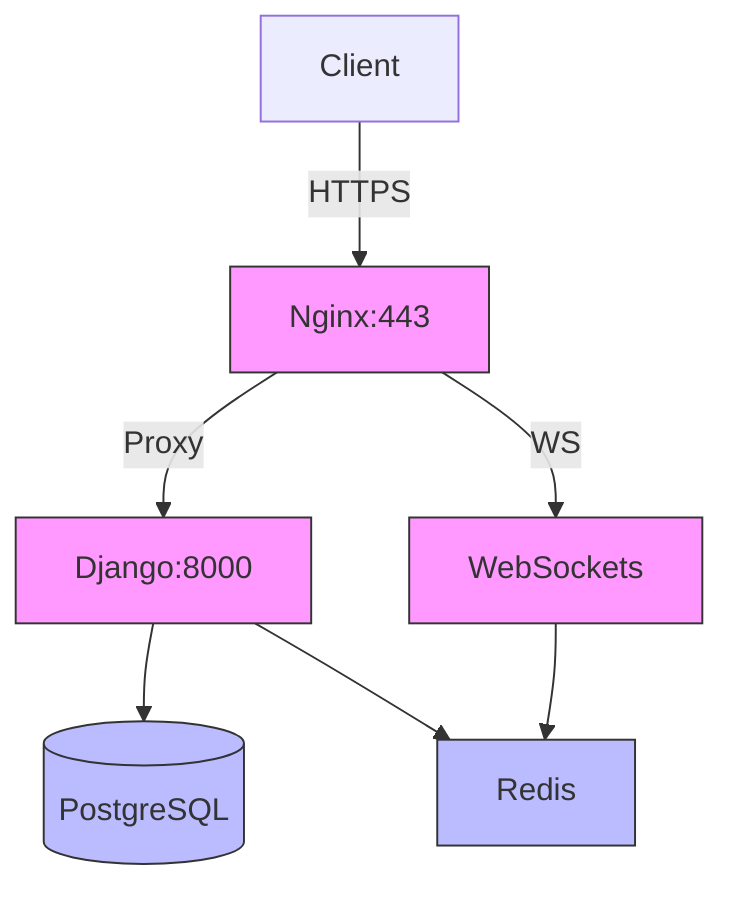

PingPong Platform - Backend System

**Group Project | My Role: Backend, Security & DevOps Lead**  
*Django | PostgreSQL | Docker | Nginx | WebSockets | OAuth/JWT*

## 🔧 My Contributions
*Containerized Services with Docker & Docker Compose:*
Django backend
PostgreSQL with persistent volumes
Redis for WebSocket messaging
Nginx reverse proxy with SSL termination
*Production-Grade Nginx Configuration:*
Load balancing
Static file serving
WebSocket proxy (/ws/ route)

🐳 Deployment Guide
Prerequisites
Docker 20.10+
Docker Compose 2.5+

Production Setup
Clone repository:
```
git clone https://github.com/Duru-DR/PingPongDjango.git
cd PingPongDjango/Manage_services
make
```

### 📈 System Architecture

