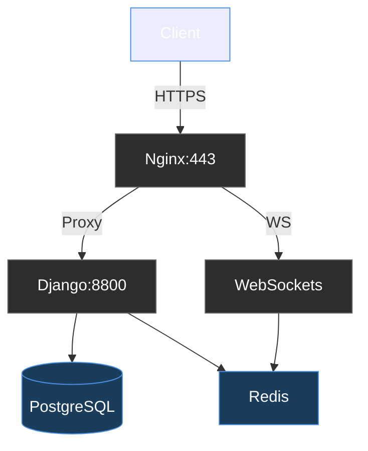

PingPong Platform - Backend System

**Group Project | My Role: Backend, Security & DevOps Lead**  
*Django | PostgreSQL | Docker | Nginx | WebSockets | OAuth/JWT | GDPR Compliance*

## 🔧 My Contributions 
#### Containerized Services with Docker & Docker Compose:

Django backend 

PostgreSQL with persistent volumes 

Redis for WebSocket messaging 

Nginx reverse proxy with SSL termination 

#### Production-Grade Nginx Configuration:

Load balancing 

Static file serving 

WebSocket proxy (/ws/ route) 

### 🛡️ Security Modules

- **Two-Factor Authentication (2FA)** with TOTP (Google Authenticator)
- **JWT Token Authentication** with refresh tokens
- **OAuth 2.0 Integration** (Google + 42Intra)
- **Password Hashing** (bcrypt)
- **SQL Injection/XSS Protection** (Django ORM sanitization)

### 📊 GDPR Compliance
  - Local data management dashboard
  - Account deletion pipeline with confirmation

### 👥 User Management
  - Registration/login
  - Profile management 
  - Friend system with online status
  - Blocklist functionality

### 💬 Real-Time Chat
  - WebSocket-based direct messaging
  - Game invitations via chat
  - Tournament notifications
  - Message persistence with privacy controls
  - and more

## 🐳 Deployment Guide 

Prerequisites 

Docker 20.10+ 

Docker Compose 2.5+ 

Production Setup 

Clone repository: 
```
git clone https://github.com/Duru-DR/PingPongDjango.git
cd PingPongDjango/Manage_services
make
```

### 📈 System Architecture 

